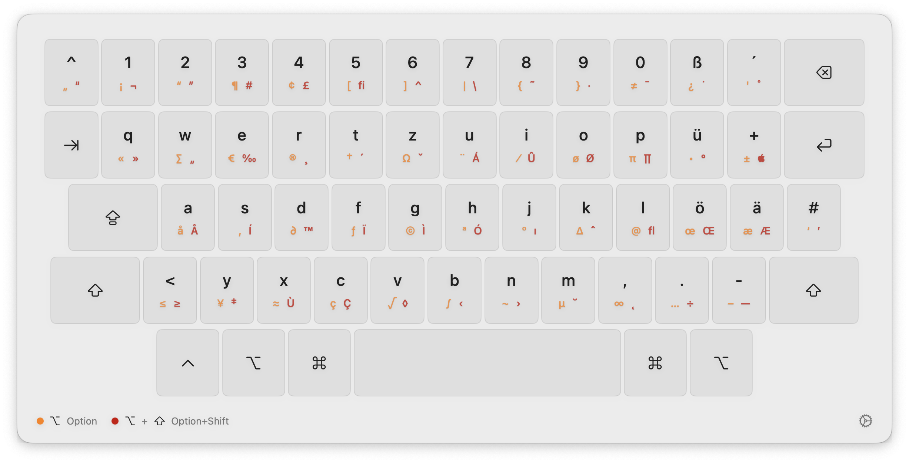
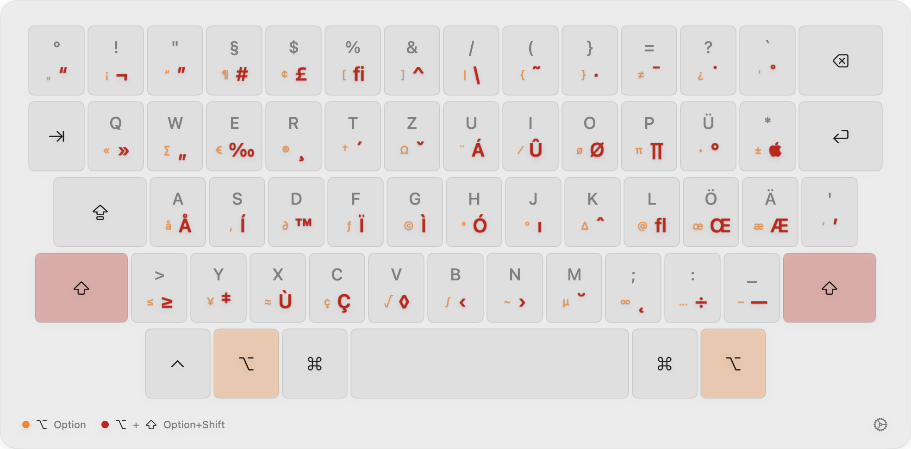
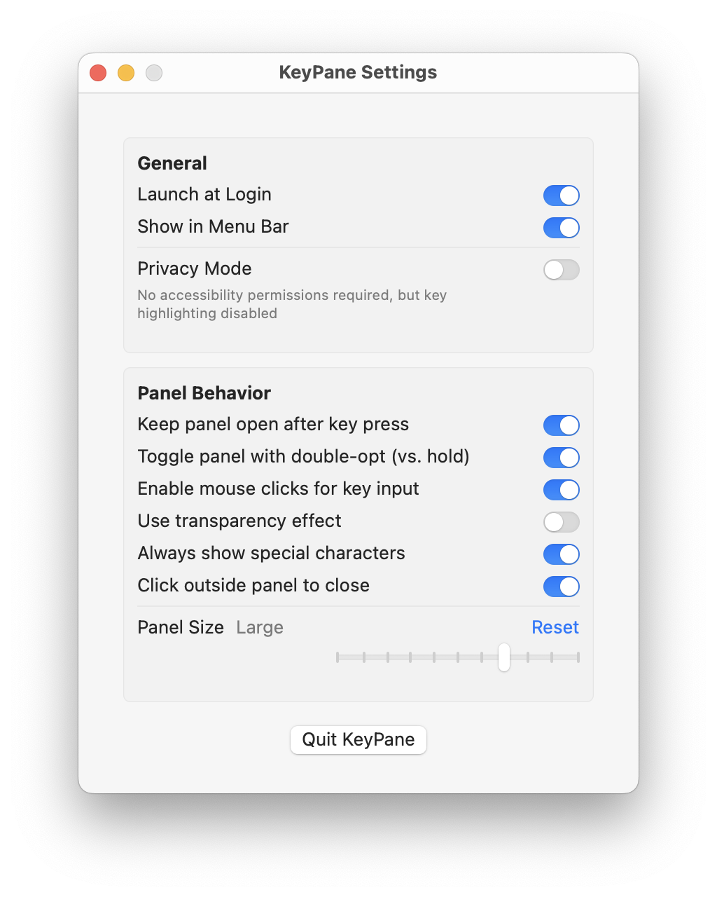
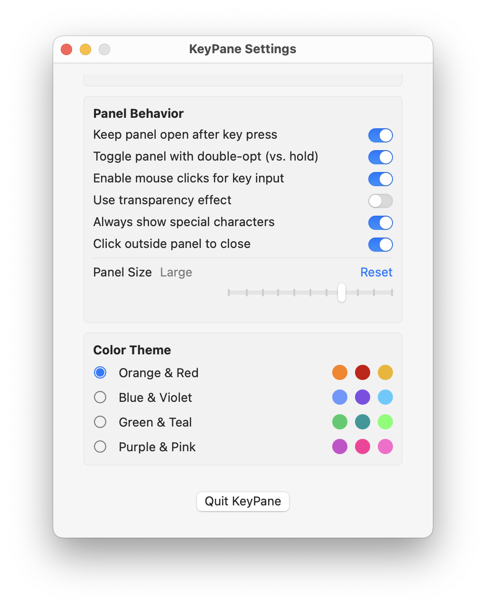

# KeyPane

A lightweight and elegant macOS utility that displays special characters for your keyboard with a modern, native UI.


## Features

- 🎯 Double-tap and hold Option key to display special characters
- 🖱️ Click characters to input them directly
- 🎨 Multiple color themes
- 🔒 Privacy mode available (no accessibility permissions required)
- ⚡ Lightweight (~40MB RAM usage)
- 🎛️ Highly customizable interface
- 🌟 Native SwiftUI interface with smooth animations
- 🔍 Shows Option and Option+Shift characters simultaneously

<div align="center">
  
  
</div>

## Installation

1. Download the latest release from the [Releases](https://github.com/danielwetzel/KeyPane/releases) page
2. Move KeyPane.app to your Applications folder
3. Launch KeyPane
4. Grant accessibility permissions when prompted (or choose Privacy Mode)

## Usage

### Basic Operation

1. Double-tap or hold the Option (⌥) key to display the keyboard panel
2. View special characters available with Option and Option+Shift modifiers
3. Click characters to input them directly (when enabled)
4. Access settings through the menu bar icon or gear button

<div align="center">
  
</div>


## Modes

### Default Mode
- Requires accessibility permissions
- Full functionality including:
  - Key highlighting
  - Real-time modifier key tracking
  - Automatic panel positioning
  - All input methods

### Privacy Mode
- No accessibility permissions required
- Limited functionality:
  - No key highlighting
  - Basic keyboard monitoring
  - Manual panel positioning
  - Click-to-input still available

## Performance

KeyPane is designed to be lightweight and efficient:
- Memory usage: ~40MB when running
- Minimal CPU usage when idle
- Efficient event handling
- Native SwiftUI implementation
- Background-optimized monitoring

## Project Structure

```
KeyPane/
├── AppDelegate.swift         # Application lifecycle and initialization
├── KeyboardManager.swift     # Keyboard event handling and monitoring
├── PanelManager.swift        # UI panel management and positioning
├── BlurPaneView.swift        # Main keyboard interface
├── SettingsManager.swift     # User preferences and settings
├── KeyboardLayout.swift      # Keyboard layout definitions
├── Resources/
│   ├── keyCodeMappings.json  # Key code to character mappings
│   └── qwertzDE.json        # German QWERTZ layout definition
└── Views/
    ├── SettingsView.swift    # Settings interface
    ├── AboutView.swift       # About window
    └── AccessibilityPermissionView.swift  # Permissions UI
```

## Keyboard Layout Support

Currently, KeyPane supports:
- German QWERTZ layout (primary)

Future releases will include:
- QWERTY (US, UK)
- AZERTY (French)
- Other international layouts


## Customization

KeyPane offers extensive customization options:

- **Panel Behavior**
  - Toggle/hold activation
  - Keep panel open after input
  - Click-to-close outside panel
  - Panel size adjustment

- **Visual Themes**
  - Orange & Red (default)
  - Blue & Violet
  - Green & Teal
  - Purple & Pink

- **Display Options**
  - Transparency effects
  - Always show special characters
  - Menu bar icon visibility

<div align="center">

</div>

## Requirements

- macOS 13.5 or later
- Apple Silicon or Intel Mac
- ~40MB RAM
- Accessibility permissions (for default mode)

## Contributing

Contributions are welcome! Please read our [Contributing Guidelines](CONTRIBUTING.md) first.

## License

KeyPane is released under the MIT License. See [LICENSE](LICENSE) for details.

## Acknowledgments

- Thanks to all contributors and testers
- Built with SwiftUI and modern Apple technologies
- Inspired by the need for a better special character input method

## Support

For support, please:
1. Search [existing issues](https://github.com/danielwetzel/KeyPane/issues)
2. Create a new issue if needed 